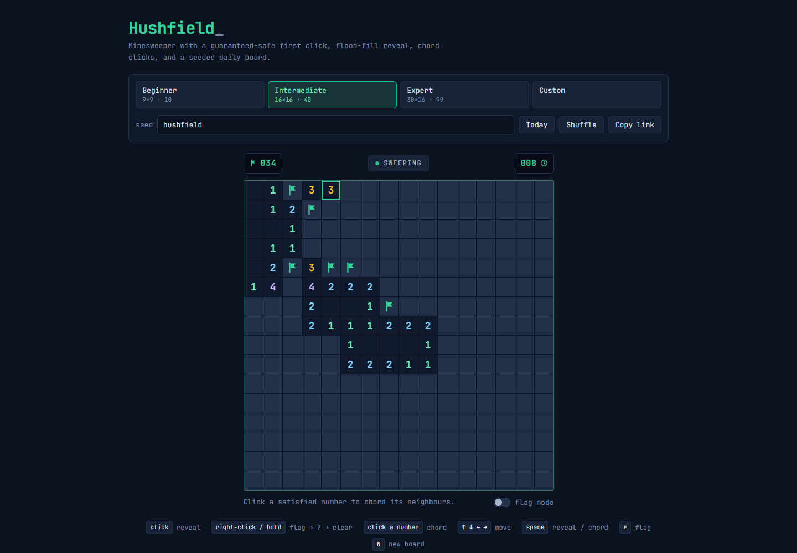

# Hushfield

A minesweeper rebuild with guaranteed-safe first click, flood-fill reveal, chord
clicks, and a seeded daily board.



Your first click always lands on a zero, and the whole region blooms open as a
ripple that radiates from the cursor. The engine is a set of pure functions over
flat typed arrays with no React in it, so every rule is unit-tested with exact
values.

## Features

- **Beginner / Intermediate / Expert** presets plus custom width, height, and
  mine count (validated against the size of the safe zone).
- **Deferred mine placement.** Mines are placed after the first click and never
  in the clicked cell or its eight neighbours, so the opening always reveals a
  region.
- **BFS flood fill** for zero-neighbour regions. Each revealed cell records its
  BFS distance, which drives the staggered reveal animation.
- **Right-click cycling** hidden -> flag -> question -> hidden, long-press on
  touch, and a flag-mode toggle.
- **Chording.** Click a revealed number whose adjacent flag count matches it to
  open every unflagged neighbour in one batch. A wrong flag loses, as in the
  desktop original.
- **Seeded boards.** Any string is a seed; the date is the default, so everyone
  gets the same daily board. The seed and size live in the URL hash for sharing.
- **Timer, remaining-mine counter, win/loss detection.** Losing exposes every
  mine and marks wrong flags; winning auto-flags what is left.
- **Keyboard play.** Arrows move a cursor, Space/Enter reveals or chords, F
  flags, N deals a new board. The grid exposes `aria-activedescendant` and
  per-cell labels.
- Personal best times per difficulty, stored locally.

## How it works

The board is five parallel arrays indexed by `y * width + x`: `mines`,
`counts`, `state`, `distance` (all `Uint8Array`) plus a few scalars. Every
engine function clones what it touches with `.slice()` and returns a new board,
so React can compare snapshots by identity and memoised cells only re-render
when their own byte changes.

**Placement** happens on the first reveal. The clicked cell and its neighbours
are struck from the eligible list; a partial Fisher-Yates shuffle driven by
mulberry32 (seeded from an FNV-1a hash of the seed string) picks `mineCount`
cells from what remains. Because the first click is part of the input, the same
seed plus the same opening click always yields the same field, and the opening
cell is always a zero.

**Reveal** is an iterative BFS. The clicked cell goes into a queue with distance
0; whenever a dequeued cell has a count of zero, its hidden, unflagged
neighbours are revealed, stamped with `distance + 1`, and enqueued. Numbered
cells are revealed but not expanded, which is what makes the region stop at its
numeric border. The UI turns `distance` into `animation-delay`, so the region
opens as a wave:

```
click x = (4,4) on a 5x5 board with one mine m at (0,0)

  counts             BFS distance (animation delay)
  m 1 . . .          m 4 4 4 4
  1 1 . . .          4 3 3 3 3      24 cells revealed:
  . . . . .    ->    4 3 2 2 2      21 zeros + the three
  . . . . .          4 3 2 1 1      "1"s bordering the mine
  . . . . x          4 3 2 1 0
```

**Chord** counts the flags around a revealed number. If they match, every
unflagged neighbour is revealed through the same BFS routine (with a base
distance of 1); if any of them is a mine the game is lost and the safe ones are
still opened so the mistake is visible. A win is simply
`revealedCount === width * height - mineCount`.

## Run

```sh
npm install
npm run dev       # local dev server
npm run build     # type-check + production build to dist/
npm test          # vitest
```

## Tech

Vite 8, React 19, TypeScript (strict), Tailwind CSS 4, Vitest 5, JetBrains Mono
via `@fontsource`. No game or state libraries.

## License

MIT
